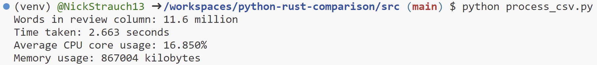

# Python vs Rust for Data Processing

Comparing the speed and resource usage of Python vs Rust for common data processing tasks.

I used two data processing tasks to generate metrics for comparison:
1. Count the number of words in the review column in the movies.csv file.
2. Sort a randomized array of 10 million integers.

## Results

### Counting the 11.6 million words in the review column in the movies.csv file
|                 | Rust                           | Python                           | Approx. Rust Improvement |
|-----------------|--------------------------------|----------------------------------|---------------------|
| Time Taken      | 0.504 seconds                  | 2.663 seconds                   | 5x              |
| CPU Usage       | 0.001%                          | 16.850%                         | 17,000x             |
| Memory Usage    | 8315 kilobytes                 | 867004 kilobytes                | 100x              |

### Sorting a randomized array of 10 million integers
|                 | Rust                           | Python                           | Approx. Rust Improvement |
|-----------------|--------------------------------|----------------------------------|---------------------|
| Time Taken      | 0.671 seconds                  | 4.87767 seconds                 | 7x              |
| CPU Usage       | 55.440%                         | 4.600%                          | 12x *worse*           |
| Memory Usage    | 8315 kilobytes                 | 116556 kilobytes                | 14x              |

Overall, Rust led to a substantial improvement in performance and resource usage. The only metric where Python outperformed Rust was CPU usage for sorting the array of integers. However, this is most likely due to Rust's ability to utilize parallelism to a greater extent than Python. While Python may have shown lower CPU usage, it's important to remember that the overall execution time was still notably slower compared to Rust. This implies that while Python may have had lower CPU utilization, it ultimately took longer to complete the task due to the multithreading limitations imposed by Python's Global Interpreter Lock (GIL). In scenarios where efficient use of CPU resources is paramount, Rust's ability to harness parallelism can be a significant advantage.

## Running the benchmarks

Run Rust:

Run Python:

